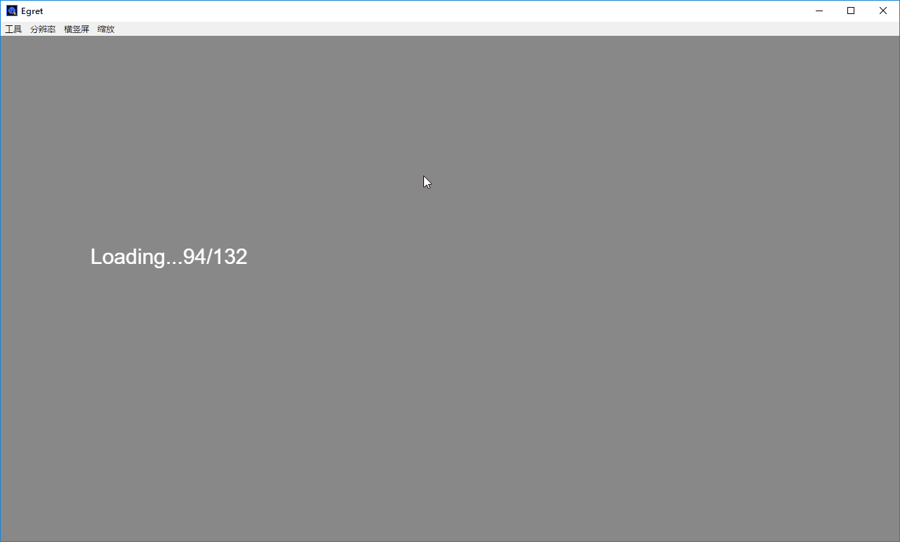
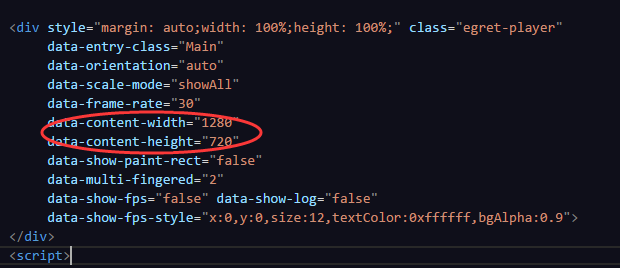

### 效果显示


### 设置舞台的宽高



### 使用命名空间必须导出
```typescript
// A.ts 导出
namespace util {
  export class A {}
}

// B.ts 使用
util.A()
```


### 一般的类不用, 就能在 '皮肤文件自定义组件中使用'


### 环境说明
OS: win10
egret engine: 3.2.6

### 使用方式
// step1 download

// step2 使用Egret Wing 打开

// step3 编译&预览效果

### 项目结构
```
├─.wing
|   ├─exml.json
|   ├─launch.json
|   ├─settings.json
|   └tasks.json
├─egretProperties.json
├─favicon.ico
├─index.html
├─README.md
├─tsconfig.json
├─wingProperties.json
├─template
|    ├─runtime
|    |    ├─native_loader.js
|    |    ├─native_require.js
|    |    └runtime_loader.js
├─src
|  ├─AssetAdapter.ts
|  ├─LoadingUI.ts
|  ├─Main.ts
|  ├─ThemeAdapter.ts
|  ├─util
|  |  ├─BitmapMovie.ts
|  |  └CutImgToo.ts
|  ├─game
|  |  └GameStage.ts
├─screenshot
|     ├─setStageSize.png
|     └show.gif
├─resource
|    ├─default.res.json
|    ├─default.thm.json
|    ├─myskins
|    |    └GameStageSkin.exml
|    ├─eui_skins
|  |    |   ├─egret.native.js
|  |    |   ├─egret.native.min.js
|  |    |   ├─egret.web.js
|  |    |   └egret.web.min.js
├─bin-debug
|     ├─AssetAdapter.js
|     ├─AssetAdapter.js.map
|     ├─LoadingUI.js
|     ├─LoadingUI.js.map
|     ├─Main.js
|     ├─Main.js.map
|     ├─ThemeAdapter.js
|     ├─ThemeAdapter.js.map
|     ├─util
|     |  ├─BitmapMovie.js
|     |  ├─BitmapMovie.js.map
|     |  ├─CutImgToo.js
|     |  └CutImgToo.js.map
|     ├─game
|     |  ├─GameStage.js
|     |  └GameStage.js.map
```