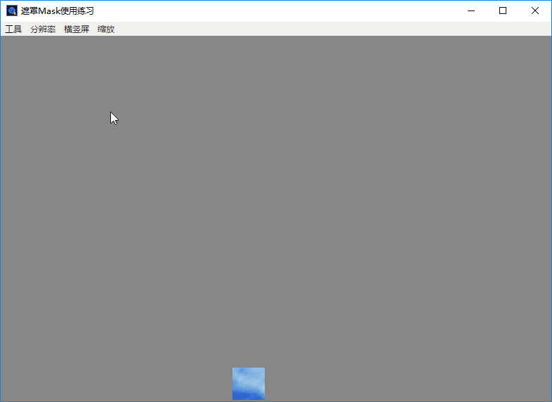

## 白鹭 `Mask` 使用练习demo

## 效果截图

## 参考资料
+ [遮罩层-百度百科](https://baike.baidu.com/item/%E9%81%AE%E7%BD%A9%E5%B1%82/7381912?fr=aladdin)
+ [AS3-遮罩](https://help.adobe.com/zh_CN/FlashPlatform/reference/actionscript/3/spark/primitives/supportClasses/GraphicElement.html#mask)
+ [白鹭遮罩API](http://developer.egret.com/cn/apidoc/index/name/egret.DisplayObject#propertySummary)
+ [白鹭定时器使用](http://edn.egret.com/cn/article/index/id/154)
+ [白鹭缓动动画](http://developer.egret.com/cn/apidoc/index/name/egret.Tween)